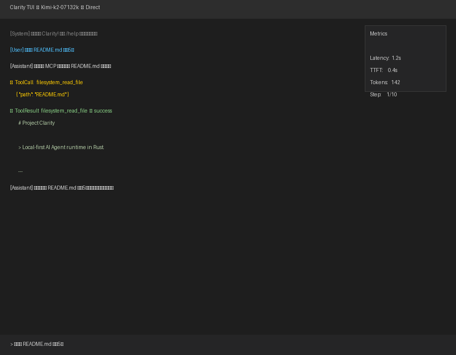

# Project Clarity

[](https://github.com/juice094/clarity/actions/workflows/ci.yml)
[](https://opensource.org/licenses/MIT)
[](https://www.rust-lang.org)

> **Local-first AI Agent runtime in Rust.**  
> 一个基于 Rust 的本地优先 AI Agent 框架，支持多模型、MCP 工具生态与数据主权。

---

## 📋 Project Status (2026-04-18)

**Phase: Core features landed, entering integration hardening.**

| Metric | Status | Note |
|--------|--------|------|
| Build | ✅ | `cargo check --workspace` passes |
| Tests | ✅ | **420+** passed, 0 failed |
| Lint | ✅ | `clippy --workspace --lib --bins --tests` zero warnings |
| Codebase | ~2.7 MB | 122 Rust files (82 library sources) |
| Binary | ~23 MB | Release `clarity-gateway.exe` |
| Crates | 5 | workspace layout |

### Feature Matrix

| Module | Status | Description |
|--------|--------|-------------|
| **clarity-core / Agent** | ✅ | ReAct loop, tool calling, stream-first responses |
| **clarity-core / Approval** | ✅ | Interactive / Yolo / Plan modes |
| **clarity-core / Compaction** | ✅ | Context compression to prevent token explosion |
| **clarity-core / Subagents** | ✅ | LaborMarket (coder/explore/plan) + Runner; model-aware routing |
| **clarity-core / MCP Client** | ✅ | Stdio/HTTP tested E2E with `filesystem` server; auto-injects into `ToolRegistry` via `mcp.json` |
| **clarity-core / Background Tasks** | ✅ | `DefaultAgentTaskExecutor` runs real Agents in worker pool; supports per-task model selection |
| **clarity-core / LLM Routing** | ✅ | `ModelRegistry` TOML config + `LlmFactory::create(alias)` + runtime hot-swap |
| **clarity-core / Local LLM** | ✅ | Kalosm GGUF inference + LlamaServer HTTP bridge (zero-dependency) |
| **clarity-tui** | ✅ | Terminal UI with mouse scroll, command registry, tab completion, input history, dark theme |
| **clarity-gateway** | ✅ | OpenAI-compatible Chat Completions API with SSE streaming + structured tool events |
| **clarity-memory** | ✅ | File / SQLite / Hybrid backends, 57 tests passing |
| **clarity-wire** | ✅ | Soul-UI broadcast channel, 8 tests passing |
| Gateway Channels | ⚠️ | Webhook ready; Discord / Telegram temporarily excluded from default build due to upstream `rustls-webpki` advisories |
| Web UI | ✅ | Embedded Web IDE (`chat.html`) with tool-call cards + config modal |

---

## 🏗 Architecture

```
┌─────────────────────────────────────────────────────────────┐
│                        Application Layer                     │
│  ┌─────────────┐  ┌─────────────┐  ┌─────────────────────┐  │
│  │ clarity-tui │  │clarity-gateway│ │   Web IDE           │  │
│  │  (Terminal) │  │  (HTTP API)   │ │   (chat.html)       │  │
│  └──────┬──────┘  └──────┬──────┘  └─────────────────────┘  │
└─────────┼────────────────┼──────────────────────────────────┘
          │                │
          ▼                ▼
┌─────────────────────────────────────────────────────────────┐
│                        Core Engine                           │
│                      clarity-core                            │
│  ┌─────────────┐  ┌─────────────┐  ┌─────────────────────┐  │
│  │    Agent    │  │ ToolRegistry│  │   LlmProvider       │  │
│  │   (ReAct)   │  │  (Tools)    │  │ (Multi-provider +   │  │
│  │             │  │             │  │  ModelRegistry)     │  │
│  └──────┬──────┘  └──────┬──────┘  └─────────────────────┘  │
│         │                │                                   │
│  ┌──────▼────────────────▼─────────────────────┐             │
│  │   Wire        - Soul-UI communication      │             │
│  │   Approval    - Tool-call approval flow    │             │
│  │   Compaction  - Context compression        │             │
│  │   Subagents   - Agent delegation           │             │
│  │   MCP Client  - External tool servers      │             │
│  └─────────────────────────────────────────────┘             │
└─────────────────────────────────────────────────────────────┘
          │
          ▼
┌─────────────────────────────────────────────────────────────┐
│                        Storage Layer                         │
│                     clarity-memory                           │
│  ┌─────────────┐  ┌─────────────┐  ┌─────────────────────┐  │
│  │  FileStore  │  │ SqliteStore │  │    HybridStore      │  │
│  │  (JSON)     │  │(SQLite+FTS5)│  │  (Cache + Archive)  │  │
│  └─────────────┘  └─────────────┘  └─────────────────────┘  │
└─────────────────────────────────────────────────────────────┘
```

---

## ✨ Core Features

### Agent Engine (`clarity-core`)

- **ReAct Loop**: Full think-act-observe cycle with cancellation support.
- **Stream-first**: Prefers `stream()`, falls back to `complete()` automatically. No double requests.
- **Wire Communication**: Decouples execution (Soul) from UI via broadcast channels.
- **Context Compaction**: Auto-compresses long conversations before token limits are hit.
- **Approval Modes**: Interactive, Yolo, or Plan-level control over dangerous tools.
- **Multi-LLM**: Kimi, Kimi Code, Anthropic, OpenAI-compatible, DeepSeek, **local GGUF via Kalosm**, **llama-server bridge**.
- **ModelRegistry**: TOML-driven provider/model configuration; per-subagent/per-task model selection.
- **Runtime Hot-swap**: Switch LLM provider without restarting via Admin API or TUI.
- **Prompt Cache Key**: Session-aware cache routing for supported providers.
- **Personality Hot-swap**: Default `Direct` engineering persona; switch via `/personality [direct|hanako|butter|ming]`.

### Subagent System (`clarity-core/src/subagents/`)

- **LaborMarket**: Type registry for `coder`, `explore`, `plan` subagents.
- **SubagentStore**: State persistence.
- **SubagentBuilder**: Config-driven builder with Git context injection.
- **Runner**: Foreground, background, and resume execution — **each can target a different model alias**.

### Memory System (`clarity-memory`)

- Backends: File, SQLite (with FTS5), Hybrid.
- `PersistentMemoryStore`: Integrated into `clarity-core`.
- `MemoryTicker`: Threshold-based memory triggers.

### Tool System

- **9 Built-in Tools**: `file_read`, `file_write`, `file_edit`, `glob`, `grep`, `bash`, `powershell`, `web_search`, `web_fetch`.
- **MCP Integration**: Load external MCP servers via `~/.config/clarity/mcp.json`; tools are automatically namespaced and injected into the registry.
- **Tool Approval**: Dangerous ops require confirmation (unless in Yolo mode).

### Gateway Web IDE (`chat.html`)

- OpenAI-compatible `/v1/chat/completions` endpoint (SSE streaming supported).
- **Structured tool-call events**: `tool_call_start` / `tool_call_delta` / `tool_result` rendered as collapsible cards.
- **User-configurable provider**: Click ⚙️ to set provider, API key, base URL, and model — persisted to `.clarity/user_config.json`.
- Admin API at `http://127.0.0.1:18800` for provider management and config inspection.

---

## 🖼 TUI Demo

A quick look at Clarity in action — asking the agent to read a file via the MCP filesystem server:



---

## 🚀 Quick Start

### Requirements

- Rust 1.75+
- Windows / Linux / macOS
- Node.js + `npx` (only if you want to use MCP stdio servers like `@modelcontextprotocol/server-filesystem`)

### Build & Test

```bash
cd clarity
cargo build --workspace
cargo test --workspace --lib --tests  # ~420+ tests passing
cargo clippy --workspace              # zero warnings
```

### Configure LLM Provider (3 ways)

**Option 1: Environment Variables** (ephemeral)
```powershell
# Kimi Code API (recommended for coding tasks)
$env:KIMI_CODE_API_KEY="sk-kimi-your-key"

# Or standard Moonshot / OpenAI / DeepSeek / Anthropic
$env:KIMI_API_KEY="sk-xxx"
$env:OPENAI_API_KEY="sk-xxx"
$env:DEEPSEEK_API_KEY="sk-xxx"
$env:ANTHROPIC_AUTH_TOKEN="sk-ant-xxx"
```

**Option 2: Web IDE Config Modal** (persisted)
```
1. Open http://127.0.0.1:18790
2. Click the ⚙️ (settings) button
3. Select provider (kimi-code / moonshot / openai / deepseek / anthropic)
4. Enter API key → Save
```

**Option 3: Admin API** (persisted)
```powershell
# Get current config
curl http://127.0.0.1:18800/api/config

# Save new config
curl -X POST http://127.0.0.1:18800/api/config `
  -H "Content-Type: application/json" `
  -d '{"provider":"kimi-code","api_key":"sk-xxx"}'
```

**Option 4: ModelRegistry TOML** (advanced, multi-model)
```toml
# ~/.config/clarity/models.toml
[[provider]]
name = "kimi-code"
type = "kimi"
base_url = "https://api.kimi.com/coding/v1"
api_key = "sk-xxx"

[[model]]
name = "kimi-k2"
provider = "kimi-code"
model_id = "kimi-k2-07132k"

[[model]]
name = "local-qwen"
provider = "llama-server"
base_url = "http://localhost:8080"
```

### Run the TUI

```powershell
cargo run -p clarity-tui
```

### Run the Gateway

```powershell
cargo run -p clarity-gateway
# API:    http://localhost:18790
# Admin:  http://127.0.0.1:18800
```

### TUI Shortcuts

| Key | Action |
|-----|--------|
| `Enter` | Send message / confirm input |
| `Esc` | Return to Normal mode |
| `↑/↓` | Browse history (Input mode) or scroll chat (Normal mode) |
| Mouse wheel | Scroll chat |
| `Tab` | Auto-complete `/` commands |
| `Ctrl+C` | Stop generation (when generating) or return to Normal mode |
| `Ctrl+D` | Quit |
| `/help` | List commands: `/model`, `/stop`, `/clear`, `/personality` |

---

## 🔧 MCP Configuration

Create `~/.config/clarity/mcp.json`:

```json
{
  "mcpServers": {
    "filesystem": {
      "command": "npx",
      "args": ["-y", "@modelcontextprotocol/server-filesystem", "."]
    }
  }
}
```

On startup, Clarity will connect to the server and register tools (e.g. `filesystem_read_file`) into the agent's tool registry automatically.

### Security: MCP Command Allowlist

To prevent command-injection attacks, stdio commands are validated before execution:
- Shell metacharacters and relative paths are rejected by default.
- Absolute paths are allowed only if they exist.
- Bare names (e.g. `npx`, `uvx`, `node`) are allowed and resolved via `PATH`.
- You can override restrictions with the environment variable:
  ```powershell
  $env:CLARITY_MCP_ALLOWLIST="/usr/bin/npx,/opt/bin"
  ```

---

## 📚 Documentation

- [`docs/mcp_integration_guide.md`](docs/mcp_integration_guide.md) — MCP design & integration
- [`docs/channel_architecture.md`](docs/channel_architecture.md) — Gateway channel architecture
- [`docs/archive/`](docs/archive/) — Historical phase reports and reality-check documents
- [`AGENTS.md`](AGENTS.md) — Agent development guidelines and conventions

---

## 🗓 Roadmap

### Phase 1: Integration Hardening (Current)
- [x] TUI real-LLM validation (Kimi Code / Moonshot)
- [x] Stream-first + Prompt Cache
- [x] Personality refactor (`Direct` persona)
- [x] TUI interaction polish (commands, history, safe Ctrl+C)
- [x] MCP Client + filesystem server E2E
- [x] Gateway Chat Completions SSE streaming
- [x] Gateway Chat tool-calling pipeline fixed (full message history + `tool_calls`)
- [x] BackgroundTaskManager real-agent execution
- [x] Embedded Web IDE (`chat.html`) in Gateway
- [x] **ModelRegistry config-driven routing**
- [x] **Runtime LLM provider hot-swap**
- [x] **User-configurable provider via Web UI / Admin API**
- [x] **Local LLM support (Kalosm + LlamaServer)**
- [x] **SSE structured tool-call events (tool_call_start/delta/result)**
- [ ] Gateway channel end-to-end testing (Webhook active; Discord/Telegram blocked by upstream CVEs)

### Phase 2: Stabilization (Next 2–4 weeks)
- [x] MCP command validation / allowlist (security hardening)
- [ ] Error handling polish
- [ ] Performance benchmarks
- [ ] Cross-platform CI matrix
- [ ] English documentation expansion

### Phase 3: Capability Expansion (1–2 months)
- [ ] MCP SSE transport
- [ ] Vector search optimization
- [ ] Multi-agent profile management
- [ ] TUI configuration file support

---

## 🤝 Contributing

Issues and PRs are welcome. If you find a discrepancy between the docs and the code, believe the code — and please open an issue so we can fix the docs.

---

## 📜 License

MIT — see [LICENSE](LICENSE).

---

*Last updated: 2026-04-18*  
*Maintained by the Clarity Team and AI Assistant.*
