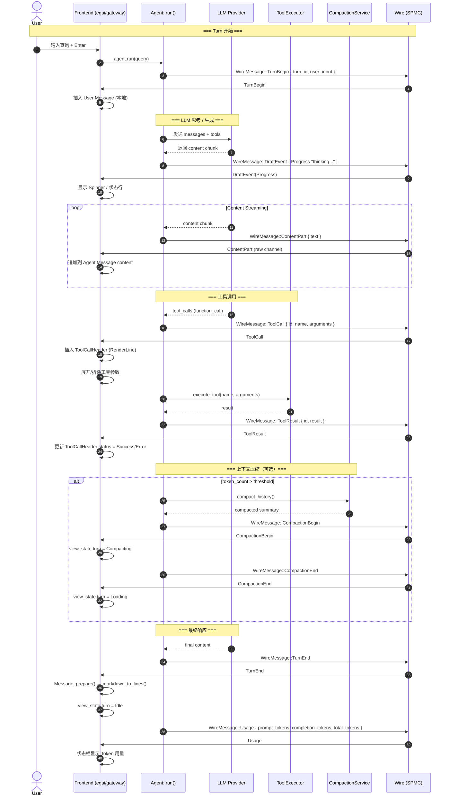
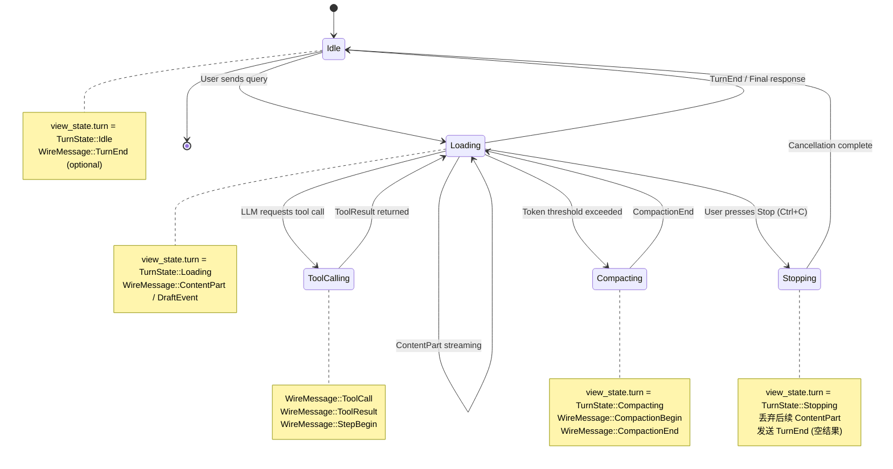
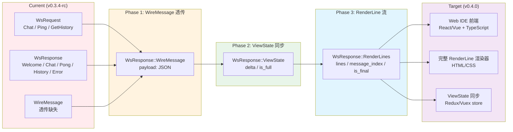

# Clarity 生命周期与管线图例

> **Status**: 草案 / 基于 v0.3.4-rc 代码审计  
> **Tools**: Mermaid (native GitHub/Docusaurus/GitLab rendering)  
> **Authors**: Agent (architect layer)  
> **Date**: 2026-06-16

---

## 图 1 — Turn 生命周期时序图（WireMessage 流）



**图例说明**：
- 实线箭头 `->>` = 同步/直接调用
- 虚线箭头 `-->>` = 异步回调/流式返回
- `Wire` 是 tokio broadcast 通道，支持多消费者（egui + tui + claw + gateway 可同时订阅）
- `ContentPart` 已统一走 `clarity-wire`（`run_streaming` callback 已移除）
- `DraftEvent` / `TurnBegin` / `TurnEnd` / `StatusUpdate` 已映射为对应 `UiEvent`
- `ViewStateUpdate` 已引入，当前同步 `turn` 字段
- `TurnEnd` 当前委托给 `UiEvent::Done`，长期将替代 `Done` 成为唯一回合结束标志

---

## 图 2 — 协议栈数据流管线图

```mermaid
flowchart TB
    subgraph Producer["Producer Layer (clarity-core)"]
        A1[Agent::run]
        A2[Agent::run_plan_mode]
        A3[Agent::run_jumpy_mode]
        A4[CompactionService]
        A5[ThreadManager]
    end

    subgraph Transport["Transport Layer (clarity-wire)"]
        direction TB
        T1[WireMessage<br/>20 variants]
        T2[SPMC Broadcast<br/>tokio::sync::broadcast]
        T3[Dual Channel<br/>raw + merged]
        T4[WireSoulSide<br/>producer]
        T5[WireUISide<br/>consumer]
    end

    subgraph Semantic["Semantic Layer (clarity-core::ui)"]
        direction TB
        S1[ViewState<br/>AppView/TurnState/FocusScope]
        S2[RenderLine<br/>13 variants]
        S3[CommandItem<br/>ShortcutRegistry]
        S4[markdown_to_lines()]
        S5[LineViewport / LineCursor]
    end

    subgraph Frontend["Frontend Layer"]
        direction LR
        F1[clarity-egui<br/>MessageBubble / turn_renderer]
        F2[clarity-tui<br/>ratatui widgets]
        F3[clarity-gateway WS<br/>Web IDE]
        F4[clarity-claw<br/>系统托盘]
    end

    A1 -->|send()| T4
    A2 -->|send()| T4
    A3 -->|send()| T4
    A4 -->|send()| T4
    A5 -->|send()| T4

    T4 --> T2
    T2 --> T3
    T3 --> T5

    T5 -->|recv()| F1
    T5 -->|recv()| F2
    T5 -->|recv()| F3
    T5 -->|recv()| F4

    F1 -.->|使用| S1
    F1 -.->|使用| S2
    F1 -.->|使用| S3
    F2 -.->|使用| S1
    F2 -.->|使用| S2
    F3 -.->|需要| S1
    F3 -.->|需要| S2

    S4 -.->|生成| S2
    S5 -.->|消费| S2

    style Producer fill:#e1f5fe
    style Transport fill:#fff3e0
    style Semantic fill:#e8f5e9
    style Frontend fill:#fce4ec
```

**图例说明**：
- 实线箭头 = 数据传输（编译期强类型）
- 虚线箭头 = 类型依赖（使用/消费关系）
- `clarity-egui` 与 `clarity-tui` 共享 `clarity-core::ui` 的 `ViewState`/`RenderLine`/`CommandItem`
- `clarity-gateway` 当前**不依赖** `clarity-core::ui`（缺少 ViewState/RenderLine 同步）
- `clarity-claw` 当前只消费 `WireMessage` 的 turn 状态变体

---

## 图 3 — Agent Turn 执行状态机



**图例说明**：
- 每个状态变化对应 `ViewState.turn` 的枚举切换
- 部分状态变化对应 `WireMessage` 发送（如 `CompactionBegin/End`）
- 当前 `TurnBegin` 和 `TurnEnd` 在 egui 前端被丢弃，状态靠 `UiEvent::Done` 间接判断

---

## 图 4 — RenderLine 渲染管线（Pretext 模型）

```mermaid
flowchart LR
    subgraph Input["Input Sources"]
        I1[Markdown text<br/>from LLM]
        I2[Tool result<br/>JSON/string]
        I3[WireMessage<br/>StatusUpdate]
        I4[User input<br/>plain text]
    end

    subgraph Parser["Parser Layer"]
        P1[pulldown-cmark<br/>Event stream]
        P2[markdown_to_lines()]
    end

    subgraph IR["Intermediate Representation"]
        R1[RenderLine::Text<br/>{ spans, role, indent }]
        R2[RenderLine::CodeLine<br/>{ lang, content, line_no, diff }]
        R3[RenderLine::ToolCallHeader<br/>{ name, status, expanded }]
        R4[RenderLine::Thinking<br/>{ content, collapsed }]
        R5[RenderLine::StatusLine<br/>{ kind, content, transient }]
        R6[RenderLine::Divider]
        R7[RenderLine::Empty]
        R8[RenderLine::BlockSlot<br/>{ block_id, line_count }]
    end

    subgraph Renderer["Frontend Renderers"]
        E1[egui<br/>MessageBubble / RichParagraph]
        E2[ratatui<br/>Text / Paragraph / List]
        E3[Web IDE<br/>HTML/CSS/JS]
    end

    I1 --> P1
    I2 --> P2
    I3 --> P2
    I4 --> P2

    P1 --> P2
    P2 --> R1
    P2 --> R2
    P2 --> R3
    P2 --> R4
    P2 --> R5
    P2 --> R6
    P2 --> R7
    P2 --> R8

    R1 --> E1
    R2 --> E1
    R3 --> E1
    R4 --> E1
    R5 --> E1
    R6 --> E1
    R7 --> E1
    R8 --> E1

    R1 --> E2
    R2 --> E2
    R3 --> E2
    R4 --> E2
    R5 --> E2
    R6 --> E2
    R7 --> E2
    R8 --> E2

    R1 -.->|待实现| E3
    R2 -.->|待实现| E3
    R3 -.->|待实现| E3
    R4 -.->|待实现| E3
    R5 -.->|待实现| E3
    R6 -.->|待实现| E3
    R7 -.->|待实现| E3
    R8 -.->|待实现| E3

    style Input fill:#e3f2fd
    style Parser fill:#fff8e1
    style IR fill:#e8f5e9
    style Renderer fill:#fce4ec
```

**图例说明**：
- 实线 = 已实现路径
- 虚线 = 待实现（Web IDE 缺少 RenderLine 渲染器）
- `BlockSlot` 是降级逃生舱（tables, images, Plan 等无法行原子化的内容）
- `R3` (ToolCallHeader) 和 `R4` (Thinking) 由 `WireMessage::ToolCall` / `ToolResult` 直接生成，不走 markdown 解析

---

## 图 5 — 后端 → 前端 完整架构拓扑

```mermaid
flowchart TB
    subgraph Backend["Backend / Infrastructure Crates"]
        direction TB
        CORE[clarity-core<br/>Agent loop / ReAct / Plan<br/>+ src/background/]
        MEM[clarity-memory<br/>SQLite / BM25 / Vector]
        LLM[clarity-llm<br/>Provider / GGUF]
        MCP[clarity-mcp<br/>stdio / SSE / WS]
        TOOL[clarity-tools<br/>File / Shell / Web]
        CHAN[clarity-channels<br/>WeChat iLink / Webhook]
        SEC[clarity-secrets<br/>enc2: secret store]
        OPEN[clarity-openclaw<br/>Gateway WS client]
        TEL[clarity-telemetry<br/>WideEvent / traces]
    end

    subgraph Contract["Contract / Persistence Crates"]
        direction TB
        CONTRACT[clarity-contract<br/>LlmProvider / Tool / AgentError]
        WIRE[clarity-wire<br/>WireMessage / SPMC]
        ROLLOUT[clarity-rollout<br/>JSONL event log]
        THREAD[clarity-thread-store<br/>ThreadStore trait]
    end

    subgraph CrossCutting["Cross-Cutting Consumers"]
        direction TB
        SUB[clarity-subagents<br/>consumes core]
    end

    subgraph Frontend["Frontend / Entry Crates"]
        direction LR
        EGUI[clarity-egui<br/>Desktop GUI]
        TUI[clarity-tui<br/>Terminal UI]
        GW[clarity-gateway<br/>Web IDE]
        CLAW[clarity-claw<br/>System Tray]
        HEAD[clarity-headless<br/>CLI / CI]
        MOB[clarity-mobile-core<br/>Mobile FFI]
    end

    subgraph Experimental["Experimental / Utility"]
        direction LR
        SLINT[clarity-slint<br/>Slint GUI]
        PROXY[clarity-anthropic-proxy<br/>Anthropic proxy]
    end

    CORE -->|produces| WIRE
    CORE -->|uses| CONTRACT
    CORE -->|uses| THREAD
    CORE -->|uses| ROLLOUT
    CORE -->|uses| MEM
    CORE -->|uses| LLM
    CORE -->|uses| MCP
    CORE -->|uses| TOOL
    CORE -->|uses| CHAN
    CORE -->|uses| SEC
    CORE -->|uses| OPEN
    CORE -->|uses| TEL

    SUB -->|consumes| CORE

    WIRE -->|consumed by| EGUI
    WIRE -->|consumed by| TUI
    WIRE -->|consumed by| GW
    WIRE -->|consumed by| CLAW
    WIRE -->|consumed by| HEAD
    WIRE -->|consumed by| MOB

    EGUI -->|also uses| CONTRACT
    TUI -->|also uses| CONTRACT
    GW -->|also uses| CONTRACT
    CLAW -->|also uses| CONTRACT
    HEAD -->|also uses| CONTRACT
    MOB -->|also uses| CONTRACT

    SLINT -->|uses| CONTRACT
    SLINT -->|uses| WIRE

    CONTRACT -.->|zero internal deps| Backend
    CONTRACT -.->|zero internal deps| Frontend

    style Backend fill:#e3f2fd
    style Contract fill:#fff8e1
    style Frontend fill:#fce4ec
```



**图例说明**：
- 实线箭头 = 编译期依赖（Cargo `dependencies`）
- 虚线箭头 = 设计约束（零内部依赖）
- `clarity-contract` 是唯一的跨层共享契约，**不依赖任何内部 crate**
- `clarity-wire` 是后端到前端的**唯一传输契约**（ADR-006 收敛结果）
- 前端 crate 之间**禁止互相 import**（走 `clarity-wire` 或 `clarity-contract`）

---

## 图 6 — Gateway WebSocket 协议升级路径



**图例说明**：
- 红色 = 当前缺失能力
- 橙色 = 短期目标（Phase 1）
- 绿色 = 中期目标（Phase 2）
- 蓝色 = 长期目标（Phase 3）
- 紫色 = 最终前端形态

---

## 图 7 — 前端事件路由（egui 内部）

```mermaid
flowchart TB
    subgraph Sources["Event Sources"]
        S1[WireMessage<br/>from clarity-wire]
        S2[User Input<br/>keyboard / mouse]
        S3[Timer / Async<br/>tokio runtime]
        S4[Gateway Poller<br/>HTTP polling]
    end

    subgraph Router["Event Router"]
        R1[UiEvent 枚举<br/>40+ variants]
        R2[ShortcutRegistry<br/>ADR-013]
        R3[FocusScope<br/>Widget > Panel > Modal > App > OS]
    end

    subgraph Handlers["Domain Handlers"]
        H1[handlers/chat.rs<br/>on_chunk / on_tool_start / on_done]
        H2[handlers/system.rs<br/>push_toast / update_status]
        H3[handlers/settings.rs<br/>provider test / model list]
        H4[handlers/subagent.rs<br/>stage / output / status]
        H5[handlers/cron.rs<br/>task list refresh]
        H6[handlers/task.rs<br/>plan step tracking]
    end

    subgraph Stores["Mutable Stores"]
        ST1[ChatStore<br/>messages / input / plan_tracker]
        ST2[SessionStore<br/>active_session / drafts]
        ST3[ViewState<br/>turn / modal / focus / panels]
        ST4[SettingsStore<br/>providers / approval_mode]
        ST5[ProjectStore<br/>project_id / context / lifecycle]
    end

    subgraph Render["Render Pipeline"]
        RE1[main.rs::update()<br/>每帧 60Hz]
        RE2[App::render_layout_shell()<br/>chrome / view / modal]
        RE3[MessageBubble<br/>RenderLine → egui widgets]
        RE4[turn_renderer.rs<br/>CLI-style turn render]
    end

    S1 --> R1
    S2 --> R2
    S3 --> R1
    S4 --> R1

    R2 --> R3
    R3 --> H1
    R3 --> H2
    R3 --> H3
    R3 --> H4
    R3 --> H5
    R3 --> H6

    H1 --> ST1
    H1 --> ST2
    H2 --> ST3
    H3 --> ST4
    H4 --> ST1
    H5 --> ST4
    H6 --> ST1

    ST1 --> RE1
    ST2 --> RE1
    ST3 --> RE1
    ST4 --> RE1
    ST5 --> RE1

    RE1 --> RE2
    RE2 --> RE3
    RE2 --> RE4

    style Sources fill:#e3f2fd
    style Router fill:#fff8e1
    style Handlers fill:#e8f5e9
    style Stores fill:#fce4ec
    style Render fill:#f3e5f5
```

**图例说明**：
- `UiEvent` 是 `clarity-egui` 内部统一事件类型，比 `WireMessage` 更贴近 UI 需求
- `ShortcutRegistry` 按 `FocusScope` 优先级路由，避免全局快捷键冲突
- `ViewState` 是跨帧持久的状态机，`Stores` 是业务域数据容器
- `MessageBubble` 和 `turn_renderer.rs` 是两套渲染路径（气泡式 vs CLI 式）

---

## 渲染指南

以上所有 Mermaid 图表支持以下平台原生渲染：

| 平台 | 语法 | 说明 |
|------|------|------|
| GitHub Markdown | ` ```mermaid ` | 仓库 README / PR / Issue 直接嵌入 |
| Docusaurus | ` ```mermaid ` + `@docusaurus/theme-mermaid` | 文档站点自动生成 SVG |
| GitLab | ` ```mermaid ` | 原生支持（GitLab 14.0+） |
| VS Code | Markdown Preview Mermaid | 插件实时预览 |
| CLI | `mmdc -i file.md -o file.svg` | [mermaid-cli](https://github.com/mermaid-js/mermaid-cli) |

### 导出为 PNG/SVG 的命令

```bash
# 安装 mermaid-cli（需要 Node.js）
npm install -g @mermaid-js/mermaid-cli

# 导出单张图（从本文件提取）
mmdc -i lifecycle-diagrams.md -o turn-lifecycle.svg

# 导出所有图（自动分页）
mmdc -i lifecycle-diagrams.md -o diagrams/

# 高 DPI PNG（适合演示文稿）
mmdc -i lifecycle-diagrams.md -o architecture.png --scale 2 --background white
```

---

## 参考文献

- `docs/architecture/protocol-layer.md` — 协议层完整设计文档
- `docs/adr/ADR-006-protocol-layer-convergence.md` — 协议收敛 ADR
- `docs/adr/ADR-012-renderline-enum-design.md` — RenderLine 设计 ADR
- `docs/adr/ADR-011-workspace-architecture.md` — 工作区架构 ADR
- `docs/adr/ADR-013-keyboard-shortcuts-claudecode-inspired.md` — FocusScope 设计 ADR
- `docs/development/CODE-CHANGE-PRINCIPLES.md` — 工程红线 P1–P7

---

*最后更新：2026-06-16*
